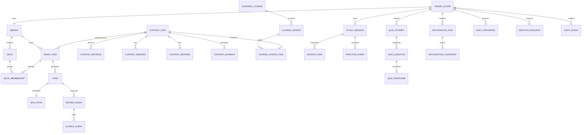

# Thiết kế cơ sở dữ liệu — Kanji Recognizer và Learning System

> **Trạng thái:** Target/Proposed trừ bằng chứng triển khai được ghi rõ. **Current:** owner đã xóa backend/frontend cũ; lần triển khai gộp Stage 1–3 khởi tạo backend Node.js mới và Library trên migration hiện có, không chạm recognition; runtime DB vẫn chưa được chứng minh khi thiếu cấu hình local. **Target decision:** PostgreSQL 18 và Fastify 5 theo plugin/encapsulation; React 19.3.0 + Vite 8.3.1 chỉ dành cho frontend về sau và frontend chưa được tạo. [PRD](./prd.md) vẫn là nguồn yêu cầu canonical; các gate triển khai/tuân thủ chưa có evidence vẫn mở.

## 1. Mục tiêu và ngoài phạm vi

Thiết kế một mô hình logic có thể triển khai tăng dần cho recognition, Library/deck, kanji/từ vựng/ngữ pháp, flashcard, quiz, SRS, progress, outbox, privacy và audit mà không khóa sớm engine lưu trữ.

Không thuộc phạm vi: application code, migration chạy thật, chọn nhà cung cấp/cloud/endpoint, credential, model nhận diện, thuật toán SRS cuối cùng, chính sách retention đã duyệt. Ảnh và nét vẽ **không được lưu mặc định**; chỉ metadata tối thiểu của lượt nhận diện được phép khi privacy gate phê duyệt.

## 2. Trạng thái quyết định và phương án persistence

| Phương án | Mô tả | Điểm mạnh | Rủi ro/gate |
|---|---|---|---|
| A — PostgreSQL local service | PostgreSQL-native trên máy/thiết bị được hỗ trợ, một owner scope cục bộ | Cùng dialect với DDL, data locality | Packaging, backup/export, multi-device/identity chưa giải quyết |
| B — PostgreSQL server | PostgreSQL-native, account là owner | Transaction, audit, multi-device | Cần account, authz, backend, privacy/ops |
| C — hybrid PostgreSQL authority | Local cache/queue + PostgreSQL authority | Offline và multi-device | Conflict, clock, tombstone, encryption và sync phức tạp |

**Target:** [reference DDL](./database-schema.sql) là PostgreSQL-native với 31 tables, 29 explicit indexes và 8 user triggers, dùng `uuid`, `timestamptz`, `jsonb`, partial index, composite FK, trigger `updated_at` và tree-integrity trigger; PostgreSQL 18 là dialect validation. **Out of scope/future:** mọi port sang engine khác cần schema/migration và bộ kiểm thử riêng, không phải compatibility contract của DDL này. Chọn A/B/C bị chặn bởi `LS-OD-01`, sync bởi `LS-OD-06`, privacy bởi `LS-OD-08`.

## 3. Bounded contexts và ownership

| Context | Aggregate/source of truth | Quyền sở hữu |
|---|---|---|
| Identity | `owner_scope` | Anonymous/local/account/hybrid chưa quyết định; mọi user-data row mang `owner_id` trực tiếp hoặc qua aggregate |
| Reference content | `content_item`, `content_revision`, readings/meanings/grammar examples | Curated/imported, provenance + license bắt buộc; không thuộc người dùng |
| Recognition | `recognition_run`, `recognition_candidate` | Owner; input binary không lưu mặc định |
| Library | `library`, `deck`, `saved_item`, `deck_membership` | Owner; reference content được tham chiếu, không sao chép tùy tiện |
| Study | `card`, `study_session`, `session_item`, `practice_event` | Owner; snapshot khóa nội dung cần tái hiện |
| SRS | `srs_state`, immutable `review_event` | Owner; ledger là bằng chứng, state là projection hiện hành |
| Quiz | `quiz_attempt`, `quiz_question`, `quiz_response` | Owner; snapshot + scoring version tái tính được |
| Progress | `daily_progress`, `metric_snapshot` | Projection rebuildable, không phải nguồn sự thật |
| Integration/privacy | `idempotency_record`, `outbox_event`, `deletion_request`, `audit_event` | Owner/system theo policy; payload tối thiểu |

N3, course 11 lesson × 80 từ và bộ metadata âm Hán Việt/nghĩa Việt/hiragana/câu ví dụ chỉ là **fixture minh họa**, không phải requirement canonical áp cho mọi nội dung. Mô hình chung dùng `content_item` cùng các bảng `content_meaning`, `content_reading`, `content_example`; Kanji mapping dùng `content_meaning(locale='vi', meaning_kind='primary')` cho nghĩa, `content_reading(script='sino_vietnamese')` cho âm Hán Việt, `content_reading(script='on'|'kun')` cho On/Kun, và `content_item.jlpt_level/stroke_count` cho JLPT/số nét. Các hàng metadata là optional và chỉ trở thành bắt buộc khi content profile/import policy khai báo. Course dùng `learning_course → course_lesson → course_lesson_item` với cardinality tùy ý và không tái sử dụng `deck`; deck là cây thư mục cá nhân nhiều tầng, còn course là reference curriculum có publish policy cấu hình được.

## 4. ER diagram



## 5. Quy ước chung

- PostgreSQL reference dùng kiểu `uuid`; ứng dụng tạo UUID chuẩn. Không suy diễn thứ tự/thời gian từ ID.
- Mọi timestamp là UTC instant bằng `timestamptz`. `local_date` là ngày lịch theo `timezone_id` IANA đã chụp tại event; mọi port sang engine khác là future/out of scope.
- `created_at` immutable; mutable aggregate có `updated_at`, `version >= 1`; xóa mềm có `deleted_at`, archive có `archived_at`.
- Enum dùng text + `CHECK` để portable. JSON chỉ dành cho snapshot/versioned payload; trường cần query/constraint phải là cột chuẩn.
- Tenant isolation: mọi truy vấn user-data bắt buộc ràng buộc `owner_id`; FK tổng hợp hoặc service authorization phải ngăn cross-owner reference.

## 6. Catalog bảng chi tiết

Ký hiệu: NN = NOT NULL; `—` = không default. Constraint mang tên ổn định trong DDL.

### 6.1 Identity và reference content

| Bảng/cột | Kiểu logic | Null/default | Ràng buộc/ý nghĩa |
|---|---|---|---|
| `owner_scope.id` | UUID-text | NN/— | PK |
| `owner_scope.kind` | enum text | NN/— | `local`, `account`, `hybrid`; không hàm ý mode đã duyệt |
| `owner_scope.external_subject` | text | nullable | UNIQUE khi có; không chứa token |
| `owner_scope.locale`, `timezone_id` | text | NN/`ja-JP`, `UTC` | preference; locale cuối cùng là LS-OD-10 |
| `owner_scope.created_at`, `updated_at`, `version`, `deleted_at` | temporal/int | NN/1/nullable | optimistic concurrency và privacy tombstone |
| `content_item.id` | UUID-text | NN | PK |
| `kind` | enum text | NN | `kanji`, `vocabulary`, `grammar` |
| `canonical_key` | text | NN | UNIQUE cùng kind; rule chính xác chờ LS-OD-02 |
| `status` | enum text | NN/`active` | `draft`, `active`, `deprecated` |
| `source_ref`, `license_ref`, `current_revision_no` | text/text/int | NN | provenance/version; deferred FK trỏ revision hiện hành |
| `jlpt_level`, `stroke_count` | smallint | nullable | projection có thể query; chỉ populate từ nguồn đã duyệt |
| `content_revision(item_id, revision_no)` | UUID/int | NN | composite PK; `payload_json` JSONB, schema/source/license; immutable |
| `content_reading.id/item_id/reading/script/reading_kind/position` | UUID/text/text/text/int | NN trên mỗi row | Metadata optional trong model chung; `reading_kind=on|kun|nanori|other`; UNIQUE theo item/reading/script/kind |
| `content_meaning.id/item_id/locale/meaning_kind/meaning/position` | UUID/text/text/text/int | NN trên mỗi row | Metadata optional trong model chung; `meaning_kind=definition|sino_vietnamese`; âm Hán Việt chỉ hợp lệ với locale `vi` |
| `content_example.id/item_id/japanese_text/translation/translation_locale/position` | UUID/text/text/text/int | translation nullable | Metadata optional trong model chung; translation và locale cùng null/cùng có; provenance bắt buộc khi có row |
| `content_profile.profile_key/item_kind/validation_rules` | text/text/JSON | `item_kind` nullable | Policy versioned mô tả metadata category, locale/script và minimum count; `UNIQUE(profile_key, item_kind)` là đích của FK ghép, không hardcode bộ bốn trường |
| `content_item.content_profile_key/kind` | text/text | profile nullable, kind NN | FK ghép `(content_profile_key, kind) → content_profile(profile_key, item_kind) MATCH SIMPLE`: profile có giá trị phải cùng kind; profile NULL bỏ qua kiểm tra FK, còn profile có `item_kind` NULL không thể được item tham chiếu |
| `learning_course.id/course_key/content_profile_key/status/validation_policy` | UUID/text/text/text/JSON | profile nullable | Reference curriculum có lesson/item tùy ý; policy optional định nghĩa allowed kind, cardinality và uniqueness; publish timestamp khớp status |
| `course_lesson.id/course_id/lesson_no/title` | UUID/int/text | NN | UNIQUE(course, lesson_no), thứ tự ổn định |
| `course_lesson_item.lesson_id/course_id/content_item_id/item_position` | UUID/int | NN | PK(lesson, position); UNIQUE(course, item), không lặp từ trong course |

`payload_json` snapshot chứa dữ liệu versioned không cần constraint theo loại: kanji (literal/strokes nếu có nguồn), vocabulary (surface/POS), grammar (pattern, formation, level, caution). Reading, meaning, example và course membership cần query/constraint nên là bảng chuẩn, không nhét vào JSON. Không được bịa metadata thiếu.

**Publish/import boundary.** Mọi item mặc định `draft`. Trong một transaction, publisher khóa item và chỉ áp dụng các minimum/category/locale/script rule của `content_profile` hoặc import policy đã chọn; khi không có profile yêu cầu, reading/meaning/example có thể thiếu và item vẫn hợp lệ. Course publisher khóa course/lessons rồi áp dụng `validation_policy` của chính course (allowed item kind, distinctness và cardinality nếu được khai báo); lesson và item count mặc định không bị ép đồng đều. Fixture tùy chọn `jlpt-n3-core` có thể cấu hình 11 lesson, 80 item/lesson, tổng 880 và bộ bốn metadata, nhưng tên/key/số này không xuất hiện trong validator dùng chung. Không dùng trigger đếm child row: trạng thái import trung gian hợp lệ khi draft và deferred trigger đa bảng dễ bỏ sót delete/update; boundary validator là API/import command bắt buộc có transaction test.

### 6.2 Recognition

| Bảng/cột | Kiểu logic | Null/default | Ràng buộc/ý nghĩa |
|---|---|---|---|
| `recognition_run.id`, `owner_id` | UUID-text | NN | PK/FK |
| `input_kind`, `status` | enum text | NN | drawing/image; pending/succeeded/failed/cancelled |
| `input_fingerprint` | text | nullable | hash có scope, chỉ khi approved; không cho tái tạo ảnh |
| `model_version`, `request_id`, `error_code` | text | nullable | operational trace; request_id UNIQUE theo owner khi có |
| `started_at`, `completed_at`, `expires_at` | instant | NN/nullable | retention; completed >= started |
| `input_retained` | boolean | NN/false | DDL CHECK luôn false trong baseline |
| `recognition_candidate.run_id/rank` | UUID/int | NN | composite PK; rank > 0 |
| `content_item_id`, `display_text`, `confidence` | UUID/text/decimal | nullable/NN | content ref nullable; confidence 0..1; no image |
| `selected_at` | instant | nullable | tối đa một selected/run cần partial index hoặc transaction check |

**Privacy-safe default:** không có cột blob/path/base64 cho ảnh/nét. Run/candidate có TTL ngắn do `LS-OD-08` quyết định; lưu item dùng immutable `content_item_id`, không copy input.

### 6.3 Library, deck và card

| Bảng/cột | Kiểu logic | Null/default | Ràng buộc/ý nghĩa |
|---|---|---|---|
| `library.id`, `owner_id` | UUID-text | NN | PK; UNIQUE owner_id (một library logic/owner) |
| `deck.id/library_id/owner_id` | UUID-text | NN | owner duplicated để auth/query; FK library |
| `deck.parent_id`, `sort_position` | UUID/bigint | nullable/1024 | self-FK; cùng library/owner; sibling order `(sort_position,id)` |
| `deck.name`, `description` | text | NN/nullable | trim/non-empty; uniqueness chờ phần còn mở của LS-OD-03 |
| `deck.created_at/updated_at/archived_at/deleted_at/version` | temporal/int | NN/nullable/1 | lifecycle; delete yêu cầu archived trước |
| `saved_item.id/library_id/owner_id/content_item_id` | UUID-text | NN | UNIQUE(library, content); dedupe |
| `saved_item.source_kind/source_ref` | enum/text | NN/nullable | recognition/import/manual/reference; provenance |
| `saved_item.created_at/archived_at/deleted_at/version` | temporal/int | NN/nullable/1 | lifecycle |
| `deck_membership.deck_id/saved_item_id` | UUID-text | NN | composite PK; idempotent save |
| `deck_membership.added_at/source_context` | instant/JSON | NN/nullable | context tối thiểu, không ảnh/nét |
| `card.id/owner_id/saved_item_id/template_key/template_version` | UUID/text/int | NN | UNIQUE(saved_item, template_key, template_version) |
| `card.prompt_revision_no/answer_revision_no` | int | NN | reference snapshot version |
| `card.enabled`, `created_at`, `updated_at`, `deleted_at`, `version` | bool/time/int | NN/true/nullable/1 | không nhân bản item truth |

Cây deck tối đa 8 tầng (root là tầng 1). Trigger PostgreSQL khóa theo library và từ chối self-parent, cycle, parent khác library/owner, parent không active, hoặc depth > 8. Archive/soft-delete theo thứ tự child-first và không xóa membership/history; parent còn descendant active không được archive, parent còn descendant chưa deleted không được soft-delete. Hard-delete bị self-FK `RESTRICT` khi còn child và vẫn cần policy; membership có thể cascade khi hard-delete, card/review không cascade từ deck. Global item delete vẫn là LS-OD-03/08 gate.

### 6.4 Study session và practice

| Bảng/cột | Kiểu logic | Null/default | Ràng buộc/ý nghĩa |
|---|---|---|---|
| `study_session.id/owner_id` | UUID-text | NN | PK/FK |
| `kind/status` | enum text | NN | flashcard/review; active/paused/completed/abandoned |
| `scope_json`, `order_seed`, `snapshot_version` | JSON/text/int | NN/nullable/1 | reproducible setup |
| `cursor`, `total_items` | int | NN/0 | 0 <= cursor <= total |
| `started_at/updated_at/completed_at/version` | temporal/int | NN/nullable/1 | terminal completion semantics |
| `session_item.session_id/ordinal` | UUID/int | NN | composite PK; immutable order |
| `card_id/content_revision_no/template_version` | UUID/int/int | NN | snapshot references; UNIQUE(session, card) unless repeat policy approves duplicates |
| `practice_event.id/session_id/card_id` | UUID | NN | append-only |
| `classification`, `occurred_at`, `idempotency_key` | enum/time/text | NN | know/again/skip; UNIQUE(owner,key); never mutates SRS |

### 6.5 SRS

| Bảng/cột | Kiểu logic | Null/default | Ràng buộc/ý nghĩa |
|---|---|---|---|
| `srs_state.card_id/owner_id` | UUID-text | NN | card PK, one current state/card |
| `phase` | enum text | NN/`new` | new/learning/review/relearning/suspended |
| `due_at`, `step_index`, `interval_days`, `ease_milli`, `lapses` | time/int | nullable/0 | phase-dependent checks partly transaction-level |
| `last_reviewed_at`, `scheduler_version`, `version` | time/text/int | nullable/NN/1 | scheduler source/version + optimistic lock |
| `review_event.id/owner_id/card_id/session_id` | UUID | NN/session nullable | immutable PK; id is `reviewId` idempotency key |
| `occurred_at/received_at/timezone_id/local_date` | time/date | NN | event time and authority evidence |
| `rating` | int | NN | 1..4 |
| `scheduler_version`, `state_version_before/after` | text/int | NN | after = before + 1 |
| `before_state_json/after_state_json` | JSON text | NN | exact immutable transition snapshot |
| `device_id` | text | nullable | pseudonymous sync aid if approved |

**Nguồn sự thật:** `review_event` là ledger append-only; `srs_state` là projection giao dịch hiện hành. Rating transaction: authorize owner → reserve idempotency key/review ID → compare expected state version → calculate once with pinned scheduler → insert event + update state + outbox atomically. Không update/delete event ngoài privacy hard-delete có audit marker tách biệt.

### 6.6 Quiz

| Bảng/cột | Kiểu logic | Null/default | Ràng buộc/ý nghĩa |
|---|---|---|---|
| `quiz_attempt.id/owner_id` | UUID | NN | PK/FK |
| `mode/status/scope_json` | enum/text | NN | meaning/reading/grammar_* chỉ sau gate; active/completed/abandoned |
| `normalization_version/scoring_version/snapshot_version` | text/int | NN | reproducibility |
| `started_at/completed_at/score_correct/score_total/version` | time/int | NN/nullable/0/1 | counts nonnegative, correct <= total |
| `quiz_question.attempt_id/ordinal` | UUID/int | NN | composite PK |
| `content_item_id/content_revision_no/prompt_json/accepted_answers_json/explanation_json` | UUID/int/JSON | NN | immutable session snapshot |
| `quiz_response.attempt_id/question_ordinal` | UUID/int | NN | one response/question |
| `answer_text`, `normalized_answer`, `is_correct` | text/bool | nullable | raw answer retention LS-OD-08; analytics excludes it |
| `submitted_at/scoring_detail_json` | time/JSON | NN | explainable result |

Retry missed tạo attempt mới và liên kết `parent_attempt_id`; không sửa attempt cũ, không tác động SRS.

### 6.7 Progress, outbox, privacy và audit

| Bảng/cột | Kiểu logic | Null/default | Ràng buộc/ý nghĩa |
|---|---|---|---|
| `daily_progress.owner_id/local_date/timezone_id` | UUID/date/text | NN | composite PK |
| counters | int | NN/0 | review/quiz/practice/activity; nonnegative |
| `review_correct/quiz_correct`, denominators | int | NN/0 | metric tách biệt |
| `source_watermark/recomputed_at/version` | text/time/int | NN | rebuild/reconcile |
| `metric_snapshot.id/owner_id/metric_key/range_start/range_end` | UUID/text/date | NN | derived cache; value_json + formula_version |
| `outbox_event.id/owner_id/aggregate_type/aggregate_id/event_type` | UUID/text | NN | append in cùng transaction |
| `outbox_event.payload_json/schema_version/occurred_at/published_at/attempt_count` | JSON/int/time | NN/nullable/0 | no raw answer/image/deck name/character text by default |
| `idempotency_record.owner_id/key/operation` | text | NN | composite PK; request_hash, response_ref/status, expiry |
| `deletion_request.id/owner_id/scope/status` | UUID/text | NN | requested/processing/completed/failed/cancelled |
| `deletion_request.requested_at/completed_at/error_code` | time/text | NN/nullable | export/delete workflow |
| `audit_event.id/owner_id/action/subject_type/subject_id/occurred_at` | UUID/text | NN/owner nullable | metadata-only; actor_ref, correlation_id, detail_json redacted |

## 7. Index strategy

Ngoài PK/UNIQUE/FK indexes: `deck(library_id,parent_id,sort_position,id)` cho tree/order, `deck(owner_id, archived_at, updated_at)`, `saved_item(owner_id, deleted_at, created_at)`, membership theo `saved_item_id`, content lookup `(kind, canonical_key)` và localized meanings/readings; `srs_state(owner_id, phase, due_at)`; events `(owner_id, occurred_at)`; sessions/attempts `(owner_id,status,updated_at)`; outbox `(published_at, occurred_at)`; deletion `(status, requested_at)`; recognition `(owner_id,started_at)` và `(expires_at)`. Full-text/trigram là vendor-specific optimization sau measurement, không có trong portable DDL. Kiểm tra query plan trước khi thêm index; tránh index payload JSON hoặc PII mặc định.

## 8. Transaction boundaries và invariants

1. Create/rename/archive/move/reorder deck: validate name, expected version and destination; take per-library transaction advisory lock; write parent/order/lifecycle + audit/outbox atomically. Sparse `sort_position` permits midpoint insert; ties are valid and sort by `id`; rebalance all siblings in the same locked transaction when no gap remains.
2. Save/remove membership: unique pair quyết định idempotency; không báo success trước commit.
3. Recognition-to-save: freeze candidate ref, resolve canonical item, upsert saved item + membership trong một transaction; không copy input.
4. Start session/quiz: snapshot eligible ordered items/questions trong một transaction; sau đó order immutable.
5. Practice classification: insert event + advance cursor atomically; không chạm SRS.
6. SRS rating: ledger + state + cursor + outbox atomically như §6.5.
7. Complete quiz: lock answers, compute pinned version, update score + outbox atomically.
8. Aggregate projector: consume event idempotently by source watermark; rebuild must cho cùng kết quả.
9. Privacy delete: freeze/mark owner, enumerate scope, delete/anonymize theo policy, tombstone idempotency, audit completion không chứa nội dung.

Deck tenant/library consistency, cycle, depth, active-parent và child-first lifecycle được trigger/FK enforce; repository phải dùng cùng advisory lock + optimistic `version` để serialize drag/drop/reorder. Các cross-row invariant còn lại như selected candidate duy nhất, phase-specific SRS fields và terminal session immutability cần transaction/service checks và test.

## 9. State machines

```text
Deck: active -> archived -> active | deleted
SavedItem: active -> archived -> active | deleted
Session/Attempt: active -> paused (study only) -> active -> completed | abandoned
SRS: new -> learning -> review -> relearning -> review; any active -> suspended -> prior/approved reset
DeletionRequest: requested -> processing -> completed | failed; requested -> cancelled
Outbox: pending -> published; pending -> retry (bounded/backoff) -> dead-letter operational state
```

Terminal attempt/session snapshots không được sửa; correction tạo event/attempt mới. Undo SRS, bury và leech vẫn bị `LS-OD-05` chặn.

## 10. Delete, retention, privacy và export

- Soft delete dành cho UX recovery/replication; hard delete là privacy operation theo `LS-OD-08`, không phải cron mặc định.
- Export gồm owner preferences, decks/memberships, saved item refs + provenance, cards, sessions, review ledger, quiz attempts và metric definitions; định dạng/version/checksum TBD.
- Xóa phải xử lý primary, replicas, caches, outbox chưa publish, search index, analytics và backup expiration; SLA/retention/age-region/consent đều Open.
- Reference content không bị xóa theo owner; liên kết user bị xóa. Audit sau deletion chỉ giữ pseudonymous operation metadata nếu pháp lý/policy cho phép.
- Recognition run/candidate TTL ngắn và raw input absent by schema. Raw quiz answer có thể nullable/short-lived theo gate.

## 11. Concurrency, idempotency và sync alternatives

Mọi mutable aggregate dùng compare-and-swap `WHERE version = expected`; mismatch trả conflict + refetch, không last-write-wins ngầm. Mutation key scoped `(owner, operation, key)`; cùng request hash trả kết quả cũ, hash khác là conflict; TTL phải dài hơn retry window.

| Sync policy | Conflict đề xuất | Chưa được duyệt |
|---|---|---|
| Local-only | single writer; export/import có manifest/version | device transfer |
| Server authority | server UTC + optimistic version; append events dedupe theo ID | account/auth/time authority |
| Hybrid | outbox/inbox, device ID, tombstone; deck text có thể manual/LWW có cảnh báo; membership set-union/remove tombstone; review event append-only, state recompute | tất cả thuộc LS-OD-06 |

Không merge SRS state bằng field-level LWW. Hợp nhất immutable review events theo ID rồi tái phát deterministic theo scheduler/version hoặc yêu cầu conflict resolution được duyệt.

## 12. SRS, quiz và progress semantics

Scheduler version + input state + rating + authoritative time tạo transition duy nhất. Preview và commit phải gọi cùng rule. Due queue chỉ đọc `srs_state`; lịch sử đọc ledger.

Quiz chụp prompt, accepted answers, explanation, revision và scoring/normalization version tại start. Grammar proposal: recognition/meaning-in-context, cloze particle/form, sentence ordering; chỉ dùng ví dụ đã review, không sinh distractor bịa đặt. Một lộ trình hợp lý: **Discover pattern → xem formation/ý nghĩa/caution → ví dụ có highlight → guided cloze → recall độc lập → mixed review**. Grammar quiz và SRS card vẫn là semantic riêng; việc cho grammar vào SRS cần product gate.

Progress được derive từ committed practice/review/quiz events. `daily_progress`/`metric_snapshot` là cache rebuildable. Review accuracy và quiz accuracy không trộn; streak dùng event category + `local_date`/timezone snapshot, chính sách đổi timezone thuộc `LS-OD-07`. “Mastered” không tồn tại trong schema.

## 13. Localization và timezone

Content meanings/examples mang BCP-47 locale; readings giữ script. UI fallback phải hiển thị unavailable, không tự dịch. UTC cho ordering/audit; IANA timezone + local date cho streak/day boundary. Đổi locale không đổi snapshot lịch sử; đổi timezone không rewrite history nếu policy chưa duyệt.

## 14. Seed/reference data và versioning

Import tạo manifest ngoài bảng hoặc audit với dataset name/version/checksum/license/source/imported_at. Mỗi `content_revision` immutable; `content_item.current_revision_no` trỏ revision active. Import idempotent theo `(kind, canonical_key, source_ref, revision)`; validation kiểm Unicode normalization, duplicate, dangling references, locale/script và license. User card pin revision; upgrade là explicit/reviewable, không silent rewrite historical snapshot.

## 15. Security boundaries

Không lưu secret/token trong DB reference. AuthN nằm ngoài schema; authZ bắt buộc tại repository/service và mọi owner query. Encrypt at rest/in transit là deployment gate; field-level encryption cân nhắc cho external subject/raw answer. Log/outbox/audit redacted; rate/size limits cho JSON/text; parameterized queries; least privilege giữa app/projector/privacy job. Backup và export được bảo vệ tương đương primary.

## 16. Backup/recovery và scale assumptions

**Assumption để thiết kế, chưa được duyệt:** mỗi owner <= 100 decks, 100k saved items, 1M review events; reference corpus <= 1M items; write rate cá nhân thấp nhưng event history tăng dài hạn. Không dùng partitioning trước đo đạc.

Backup: encrypted, checksum, restore rehearsal vào isolated environment, point-in-time capability nếu server mode, local export/atomic file copy nếu local mode. RPO/RTO, geographic residency, backup retention và deletion propagation là gate `LS-OD-01/08`. Restore phải kiểm FK, event→state reconciliation, watermark/outbox và sample owner isolation.

## 17. Migration/versioning và observability

Schema có monotonic migration ID/checksum ở implementation phase; expand → backfill → verify → contract, rollback không xóa ledger. Scheduler/content/scoring/event payload có version riêng với schema. Empty→latest và behavioral fixtures chạy trực tiếp trên PostgreSQL 18.

Data-quality checks: orphan FK, cross-owner mismatch, duplicate canonical/membership/idempotency key, negative counters, invalid timestamp order, SRS state khác replay, quiz score khác responses, aggregate khác source, expired recognition rows, stuck outbox/deletion, missing provenance/license. Metrics chỉ đếm và latency/error; không label bằng character/deck/raw answer.

## 18. Engine boundary

DDL tham chiếu và validation hiện chỉ hỗ trợ PostgreSQL-native. Port sang engine khác là **Future/Out of scope**: phải có ADR, schema/migration riêng và evidence tương đương; không được quảng bá là tương thích từ tài liệu này.

## 19. Traceability và unresolved decisions

| Decision | Ảnh hưởng trực tiếp | Implementation gate |
|---|---|---|
| LS-OD-01 | owner kind, A/B/C, backup, migration | DB-001/002/005/016 |
| LS-OD-02 | canonical key, sources, editable content | DB-003/006; vocabulary/grammar extension |
| LS-OD-03 | deck uniqueness/delete/archive | DB-004/008 |
| LS-OD-04 | quiz modes/accepted answers | DB-011; grammar quiz proposal |
| LS-OD-05 | scheduler/day/undo/leech/version | DB-010 |
| LS-OD-06 | time authority/offline/conflict/sync | DB-009/010/015 |
| LS-OD-07 | active day/streak/timezone | DB-012 |
| LS-OD-08 | retention/export/delete/consent | DB-007/013/016 |
| LS-OD-09 | metric hierarchy | DB-012 |
| LS-OD-10 | locales/translations/display | DB-003/006/011 |

Requirement mapping: recognition FR-001..010/NFR-001..005 → recognition/privacy/operations; LS-FR-001..005 → Library; LS-FR-006..007 → study; LS-FR-008..009 → quiz; LS-FR-010..014 → SRS/progress; LS-FR-015..017 → state truthfulness/access/privacy. LUS-001..017 remain acceptance-level traceability. Vocabulary/grammar CRUD and grammar pedagogy are **Assumption/Target extension** pending canonical requirements.

## 20. Kết quả rà soát phản hồi schema

**Target/Proposed (reference design, đã kiểm tra DDL nhưng chưa triển khai sản phẩm):** Đã áp dụng các nhận xét đúng: owner isolation bằng composite FK xuyên library/deck/saved item/card/session; bỏ kiểm tra thứ tự đồng hồ client/server; chống double-rating theo `(card_id, state_version_before)`; tách `suspended` khỏi phase; thêm reading kind/JLPT/strokes; partial unique cho soft-delete và candidate được chọn; hỗ trợ requeue bằng `pass_no`; dùng `jsonb`; outcome quiz có `skipped`; thêm FK indexes và trigger `updated_at`. Nội dung chuẩn hóa là projection của revision hiện hành và phải cập nhật cùng transaction.

**Đúng nhưng còn gated:** seed phải phủ model labels; timezone/streak, account deletion và undo-by-compensation cần policy tại `LS-OD-02/05/07/08`, nên chỉ ghi contract/evidence chứ không thêm trigger nghiệp vụ. `account_all` dùng tombstone + xóa `external_subject` cho tới khi retention được duyệt.

**Không áp dụng nguyên trạng:** Không loại grammar khỏi reference schema vì tài liệu hiện tại đã gắn rõ đây là extension Target/Proposed có gate; không biến mọi invariant thành trigger vì rating transaction, projection import, immutable ledger và deletion orchestration cần repository/service tests. Không tuyên bố compatibility với engine khác từ file PostgreSQL-native; mọi port là future/out of scope và cần schema/migration riêng.
